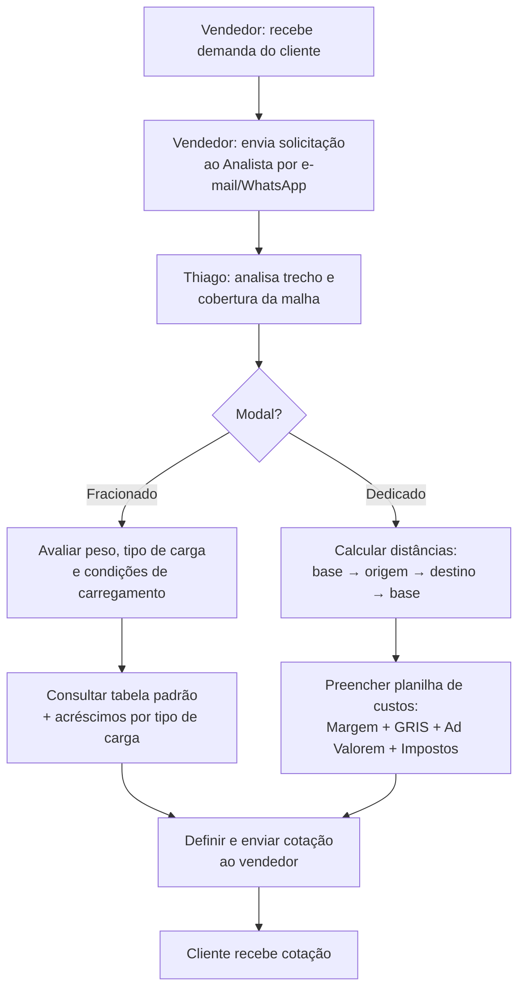
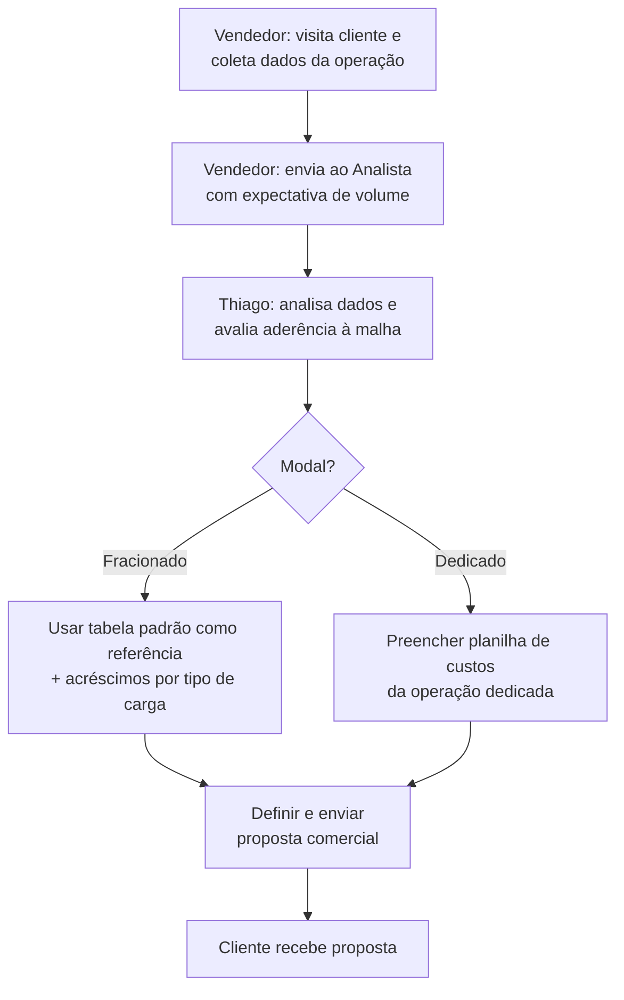
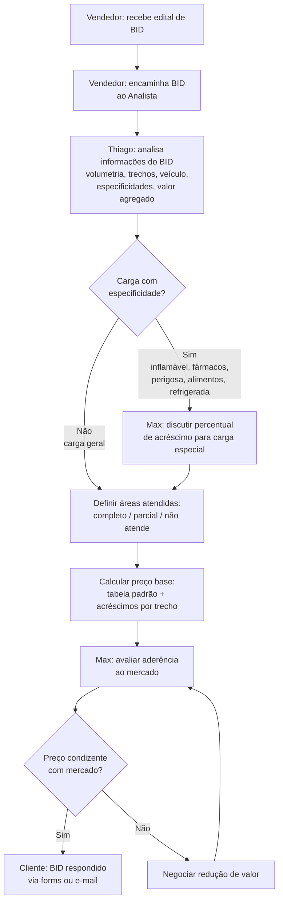

# Proposta Nokk-Chat — Automação de Precificação Lauto

> Documento de trabalho para construção do orçamento comercial.
> Baseado em `docs/resumo.pdf` (reunião com Thiago — 22/04/2026).
>
> **Status:** rascunho interno — números a validar com discovery.

---

## 1. Contexto do cliente

**Cliente:** Lauto (transportadora)
**Stakeholders mapeados:**
- **Vendedor** — prospecta cliente e captura demanda
- **Thiago** — Analista de Precificação (gargalo central do processo)
- **Max** — Diretor Comercial (aprovações de carga especial e competitividade)

**Canal oficial:** e-mail. WhatsApp ocorre em paralelo, mas não é padrão — há esforço para centralizar no e-mail.

**Dor central:** todo o processo de precificação depende do tempo do Thiago. Cotação padrão leva horas, proposta comercial leva dias, BID leva ~1 semana. A capacidade de resposta limita receita nova.

---

## 2. Modalidades de precificação

| Modalidade | Complexidade | Volume | Tempo médio | Potencial de automação |
|---|---|---|---|---|
| Cotação Padrão | Baixa | **Alto** | Horas | Alto (regras + tabela) |
| Proposta Comercial | Média | Médio | Dias | Médio (assistido) |
| BID | Alta | Baixo | ~1 semana | **Alto** (IA + diagnóstico) |

---

## 3. Fluxo 1 — Cotação Padrão

Processo mais comum e rápido. Solicitações pontuais via portal **BRUDAM**, tabela ou e-mail.

### 3.1 Diagrama



### 3.2 Atividades

| # | Atividade | Responsável | Entrada | Saída |
|---|---|---|---|---|
| 1 | Receber demanda do cliente | Vendedor | Contato com necessidade de frete | Dados básicos da operação |
| 2 | Enviar solicitação ao Analista | Vendedor | Dados da operação | Solicitação por e-mail (preferencial) |
| 3 | Analisar trecho e cobertura de malha | Thiago | Origem e destino | Confirmação: total / parcial / não atende |
| 4a | Avaliar carga (Fracionado) | Thiago | Dados de carga | Carga classificada |
| 4b | Calcular distâncias da rota (Dedicado) | Thiago | Origem, destino, base | Distância total |
| 5a | Consultar tabela padrão (Fracionado) | Thiago | Trecho + classificação | Valor com acréscimos |
| 5b | Preencher planilha de custos (Dedicado) | Thiago | Distâncias, veículo, especificidades | Planilha com valor final |
| 6 | Definir e enviar cotação | Thiago | Tabela ou planilha | Cotação enviada (e-mail / portal BRUDAM) |

### 3.3 Gateway

- **Modal? (XOR)**
  - **Fracionado** → consulta tabela padrão diretamente
  - **Dedicado** → planilha de custos com cálculo de rota completa

---

## 4. Fluxo 2 — Proposta Comercial

Vendedor visita o cliente e traz dados para uma proposta personalizada. Pode incluir referência de preço de concorrentes.

### 4.1 Diagrama



### 4.2 Atividades

| # | Atividade | Responsável | Entrada | Saída |
|---|---|---|---|---|
| 1 | Visitar cliente e coletar dados | Vendedor | Interesse do cliente | Dados + expectativa de volume |
| 2 | Enviar solicitação ao Analista | Vendedor | Dados da operação | Solicitação com contexto de demanda |
| 3 | Analisar dados e aderência à malha | Thiago | Dados + expectativa | Escopo da proposta |
| 4a | Tabela padrão como referência (Fracionado) | Thiago | Tabela + expectativa | Valor estimado |
| 4b | Planilha de custos (Dedicado) | Thiago | Demanda dedicada | Planilha com custos |
| 5 | Definir e enviar proposta | Thiago | Valores calculados | Proposta enviada por e-mail |

### 4.3 Gateway

- **Modal? (XOR)** — mesma lógica da Cotação Padrão, aplicado sobre expectativa de volume.

---

## 5. Fluxo 3 — BID

Concorrência formal lançada pelo cliente. Geralmente para operações dedicadas de grande porte. Pode levar até uma semana para resposta.

### 5.1 Diagrama



### 5.2 Atividades

| # | Atividade | Responsável | Entrada | Saída |
|---|---|---|---|---|
| 1 | Receber edital do cliente | Vendedor | Edital de BID | Documento em mãos |
| 2 | Encaminhar ao Analista | Vendedor | Edital + contexto estratégico | BID encaminhado |
| 3 | Analisar informações do BID | Thiago | Documento de BID | Operação mapeada e classificada |
| 4 | Discutir % de acréscimo (se especial) | Max | Tipo de especificidade | Percentual acordado |
| 5 | Definir áreas atendidas | Thiago | Malha Lauto + trechos do BID | Mapa de cobertura |
| 6 | Calcular preço base por trecho | Thiago | Tabela + cobertura + acréscimos | Proposta por trecho |
| 7 | Avaliar aderência ao mercado | Max | Proposta + mercado + volumetria | Decisão de competitividade |
| 8 | Negociar redução de valor | Max + Thiago | Preço + referência + volumetria | Novo valor ou desistência |

### 5.3 Especificidades de carga avaliadas

- Inflamável
- Fármacos / medicamentos (regulação ANVISA)
- Carga perigosa
- Alimentos (restrição de mix de cargas)
- Refrigerada (veículo especial, custo maior)
- Valor agregado alto (impacto em seguro / GRIS)

### 5.4 Gateways

- **Carga com especificidade? (XOR)**
  - **Sim** → discutir % de acréscimo com Max antes do preço
  - **Não** → segue direto para definição de áreas
- **Preço condizente com mercado? (XOR)**
  - **Sim** → envia ao cliente
  - **Não** → renegocia; se inviável, não participa

---

## 6. Observações gerais (extraídas do documento)

- **Canal oficial:** e-mail. WhatsApp existe mas não é padrão.
- **Tabela padrão:** referência central para Cotação Padrão e Proposta Comercial fracionada.
- **Percentuais de acréscimo NÃO são fixos hoje** — definidos caso a caso. O documento explicita que essa padronização é "evolução importante para viabilizar automatização". **→ Entrega obrigatória da fase de setup.**
- **BID tem maior potencial de automação** apesar de mais trabalhoso. Ganho concentrado em: leitura do edital, diagnóstico inicial de cobertura, comparação com clientes sinérgicos.
- **Modal no BID** já vem definido pelo cliente. Aéreo (ex.: Azul Cargo) requer cotação externa — **fora do escopo de automação**.
- **Cobertura parcial em BID nacional:** raramente atendido integralmente; proposta cobre apenas regiões efetivamente atendidas.

---

## 7. Mapeamento Nokk-Chat × Lauto

| Capacidade Nokk | Aplicação no processo Lauto |
|---|---|
| Omnichannel (e-mail + WhatsApp) | Captura de entrada do vendedor/cliente, centralização no e-mail oficial |
| Disparo de e-mail | Resposta de cotação, follow-up, envio de proposta |
| IA com análise de documento (Jina + LLM) | **Leitura de edital BID** — ponto de maior valor |
| Automação / orquestração | Cotação padrão automática, classificação de carga, roteamento por modal |
| Workflow com gates de aprovação | Acréscimo carga especial → Max; preço fora de mercado → renegociação |

---

## 8. SKUs propostos

### SKU 1 — Cotação Padrão Automatizada

**Escopo**
- Entrada por e-mail / WhatsApp / portal BRUDAM
- Extração estruturada (origem, destino, peso, tipo de carga)
- Validação de cobertura de malha
- Cálculo automático: tabela padrão + acréscimos
- Resposta em minutos ao vendedor / cliente

**Ganho vendido:** redução de ~80% do tempo do Thiago no fluxo de maior volume.

**Métrica de sucesso:** % de cotações respondidas sem intervenção humana; tempo médio de resposta.

---

### SKU 2 — Assistente de Proposta Comercial

**Escopo**
- Vendedor envia dados da visita (e-mail / WhatsApp)
- Sistema extrai, valida malha, monta planilha de custos preliminar
- Thiago revisa e aprova (não digita do zero)
- Histórico de propostas por cliente

**Ganho vendido:** padronização de propostas + ciclo de dias para horas.

**Métrica de sucesso:** tempo médio Vendedor → Cliente; taxa de retrabalho.

---

### SKU 3 — Diagnóstico de BID (Premium IA)

**Escopo**
- Upload do edital → leitura por IA (Jina + LLM)
- Saída automática:
  - Mapa de cobertura por trecho (atende / parcial / não atende)
  - Lista de clientes sinérgicos na rota
  - Preço-base por trecho aplicando tabela padrão
  - Flag de cargas especiais com sugestão de acréscimo
  - Estimativa de competitividade por trecho
- Thiago + Max recebem **draft pronto para revisar**

**Ganho vendido:** ciclo de ~1 semana → ~1 dia. Capacidade de participar de **mais BIDs** com mesma equipe.

**Métrica de sucesso:** nº de BIDs respondidos/mês; taxa de vitória.

---

## 9. Estrutura comercial — Hybrid Pricing

> **Modelo:** duas camadas com responsabilidades econômicas distintas.
> A FIXA dá previsibilidade ao cliente e gera MRR previsível. A VARIÁVEL
> protege a margem da Nokk em operações com COGS de IA não-linear.
>
> Unit economics validada em `crates/lauto-pricing` contra 3 BIDs reais
> do PNCP (Marinha PE 90008, Marinha PE 90019, Exército PE 90015).
> COGS direto de IA por documento: R$ 0,003 a R$ 4,55 (worst case).
> Margem real defendida por **estrutura de preço**, não por markup de token.

---

### 9.1 Visão geral do modelo

```
HYBRID PRICING — ARQUITETURA

┌─ Camada FIXA — previsibilidade pro cliente, recorrência pra Nokk
│   1. Mensalidade da plataforma
│   2. Franquia inclusa de WhatsApp + E-mail
│   3. Volume incluso de execuções leves (Cotações Padrão)
│
└─ Camada VARIÁVEL — proteção de margem em cima de COGS de IA
    1. Créditos de automação para tarefas com IA pesada (BID)
    2. Cobrança quando passa da franquia (esgotamento do pacote)
    3. Cliente vê em "BIDs analisados" / "documentos processados",
       nunca em "tokens" (cliente B2B não opera nessa unidade)
```

---

### 9.2 Camada FIXA

> Previsibilidade pro cliente, recorrência pra você.

#### 9.2.1 — Mensalidade da plataforma

**R$ 2.490 / mês** · compromisso 12 meses.

Cliente paga uma vez no mês e recebe pacote operacional fechado:

| Item | Inclusão |
|---|---|
| Workspace Nokk dedicado ao CNPJ Lauto | — |
| Subdomínio próprio (ex.: `lauto.nokkchat.com.br`) | — |
| Usuários internos | **5 inclusos** |
| Papéis configuráveis (RBAC) | Vendedor / Analista / Diretor / Admin |
| Dashboards operacionais e relatórios mensais | — |
| Suporte humano nominal (não call center) | 8×5, primeiro contato em 4h úteis |
| SLA de disponibilidade | **99,5%** mensal com crédito automático |
| Atualizações da plataforma | sem custo extra |
| Backup diário com retenção de 90 dias | — |

**Forma de pagamento:** boleto / PIX / débito automático no 5º dia útil.
**Reajuste:** IPCA anual no aniversário do contrato.
**Multa por atraso:** 2% + juros de 1% a.m. + correção IPCA.
**Suspensão:** após 15 dias de atraso, com aviso prévio de 5 dias úteis.
**Multa rescisória (12m):** 50% das mensalidades remanescentes.

**Descontos por antecipação:**

| Modalidade | Mensalidade efetiva | Desconto |
|---|---|---|
| Mensal | R$ 2.490 | — |
| Trimestral à vista | R$ 2.366 | 5% |
| Anual à vista | R$ 2.241 | 10% |

> Walk-away mínimo: **R$ 1.890**. Abaixo disso o custo de servir > receita.

#### 9.2.2 — Franquia inclusa de WhatsApp + E-mail

A Mensalidade já inclui a comunicação operacional do dia-a-dia da Lauto:

| Canal | Franquia mensal | Definição |
|---|---|---|
| **WhatsApp Business** | **3.000 conversas** | 1 conversa = janela de 24h Meta (não mensagem) |
| **E-mail outbound** | **5.000 envios** | Domínio oficial Lauto com DKIM/SPF/DMARC pela Nokk |

**Inbound é ilimitado** em ambos os canais. **Bounces e falhas não computam**
na franquia — cliente paga só por entrega efetiva.

**SLA específico de comunicação:**

| Métrica | WhatsApp | E-mail |
|---|---|---|
| Taxa de entrega mínima | 99% | 98% |
| Tempo de envio | < 5s | < 30s |
| Auditoria de reputação | — | mensal |

**Excedente faturado no mês seguinte:**

| Excedeu | Cobrança |
|---|---|
| WhatsApp (>3.000 conversas) | **R$ 0,20 / conversa** |
| E-mail (>5.000 envios) | **R$ 25 / mil** (proporcional) |

**Restrição importante:** marketing massivo (>500 envios idênticos a
destinatários distintos em 24h) **não está coberto** pela franquia
transacional. Nesse cenário o sistema pausa o disparo, alerta o cliente
e oferece o add-on **Marketing E-mail/WhatsApp (R$ 290/mês)**.
Proteção mútua: spam massivo via canal transacional derruba a
deliverability do domínio Lauto em horas.

#### 9.2.3 — Volume incluso de execuções leves (Cotação Padrão)

A Mensalidade também inclui **600 Cotações Padrão automatizadas / mês**.

**Cotação Padrão** é toda demanda pontual de frete que atende
cumulativamente:

```
☑ Origem e destino dentro da malha Lauto
☑ Carga geral (sem cargas especiais regulatórias)
☑ Modal Fracionado OU Dedicado (rodoviário)
☑ Solicitação pontual (não contrato recorrente)
☑ Volume conhecido (peso, m³, valor)
☑ Cliente cadastrado
☑ Sem aprovação prévia do Diretor Comercial necessária
```

Se TODOS marcados → automatizada nesta camada.
Se UM falhar → sobe para Proposta Comercial (Camada VARIÁVEL).

**Canais de entrada cobertos pela mesma franquia:**

| Canal | Volume típico Lauto |
|---|---|
| E-mail oficial (`cotacao@lauto.com.br`) | ~50% |
| WhatsApp Business | ~30% |
| Portal BRUDAM (integração) | ~20% |

**SLA de Cotação Padrão:**

| Métrica | Compromisso |
|---|---|
| Tempo de resposta automatizada | **< 2 minutos** em horário comercial |
| Tempo fora de horário comercial | < 15 minutos após abertura do expediente |
| Taxa de automatização (sem revisão humana) | **≥ 80%** |
| Acurácia vs. tabela travada | 100% |
| Reanálise da mesma cotação em até 7 dias | sem custo (cache) |

**Excedente:** **R$ 2,80 / cotação adicional**, faturada no mês seguinte.

> **Bloqueador funcional do setup:** a automação só roda com a Tabela
> Padronizada de % de Acréscimo travada no sistema (entregue na
> consultoria de setup, R$ 6.500 do escopo).

#### Por que estes três sub-itens **e não outros** estão na FIXA

| Critério | Justificativa |
|---|---|
| COGS marginal previsível e baixo | Comunicação ~R$ 0,07 max · Cotação Padrão R$ 0,003 |
| Variância de COGS quase zero | Linear no volume — sem outliers que quebrem margem |
| Volume mensal alto e regular | 3k+ conversas, 5k+ e-mails, 600 cotações |
| Cliente espera "isso vem incluso" | Operação comercial básica, não premium |

#### Por que a FIXA tem margem direta baixa (~12%)

A função econômica desta camada é **cobrir o custo de servir**, não gerar
o lucro do contrato:

| Componente do custo Nokk | Mensal | % da Mensalidade |
|---|---|---|
| Suporte L1/L2 (parte de 1 FTE) | R$ 1.200 | 48% |
| Engenharia de manutenção | R$ 600 | 24% |
| Infra (compute, storage, observabilidade) | R$ 180 | 7% |
| Comunicação (Meta + SES) | R$ 225 | 9% |
| IA cotações leves | R$ 2 | <1% |
| Reserva técnica | R$ 60 | 2% |
| **Total custo servir** | **~R$ 2.270** | **91%** |
| **Margem direta** | **~R$ 220** | **9%** |

> **O lucro real do contrato vem da Camada VARIÁVEL.** É por design.

---

### 9.3 Camada VARIÁVEL

> Proteção da margem em cima do COGS de IA pesada.

#### 9.3.1 — Créditos de automação para tarefas com IA pesada (BID)

Esta camada cobre tudo que envolve **análise de documento por IA**:
**BIDs** (editais, concorrências) e **Propostas Comerciais** customizadas.

**Por que separada da FIXA:** o COGS varia 50× entre o caso típico e o
outlier. Sem pacote pré-pago e saldo finito, um único cliente abusivo
quebra a margem.

##### Os 3 pacotes (cliente vê em BIDs e Propostas)

| Pacote | Mensal | Inclui no mês |
|---|---|---|
| **Light** | R$ 690 | 1 BID Complexo · 2 BIDs Padrão · 5 BIDs Simples · 30 Propostas |
| **Growth** ★ | **R$ 2.290** | 3 BIDs Complexos · 5 BIDs Padrão · 12 BIDs Simples · 80 Propostas |
| **Scale** | R$ 4.990 | 8 BIDs Complexos · 12 BIDs Padrão · 30 BIDs Simples · 200 Propostas |

##### Classificação automática de complexidade

Sistema classifica o documento na entrada — **cliente não escolhe e não
pode forçar para baixo**:

| Categoria | Critério visível ao cliente | Tempo médio |
|---|---|---|
| **BID Simples** | até 10 páginas, sem cargas especiais | < 1 min |
| **BID Padrão** | 10–40 págs OU 1 carga especial | 2–3 min |
| **BID Complexo** | 40+ págs OU múltiplas cargas especiais | 5–8 min |
| **Análise Estendida** | 150+ págs | sob consulta (revisão técnica prévia) |

> Direito do cliente: solicitar **reclassificação fundamentada** em até
> 5 dias úteis após a análise.

##### Mecanismo interno (oculto ao cliente)

Internamente o sistema usa **créditos** como unidade contábil única —
necessário para reconciliação, promoção entre categorias e auditoria.
**Cliente nunca vê a palavra "crédito"** — vê seu saldo em BIDs e Propostas.

| Operação | Créditos internos | Visível ao cliente |
|---|---|---|
| 1 Proposta Comercial | 2 | "1 Proposta" |
| 1 BID Simples | 3 | "1 BID Simples" |
| 1 BID Padrão | 10 | "1 BID Padrão" |
| 1 BID Complexo | 30 | "1 BID Complexo" |

> Ver §9.3.3 para detalhe da linguagem visível.

##### Promoção entre categorias

Quando o cliente esgota uma categoria mas tem saldo em outras, sistema
**oferece substituição com confirmação explícita**:

| 1 unidade de | Pode ser substituída por |
|---|---|
| BID Complexo | 3 BIDs Padrão **ou** 9 BIDs Simples |
| BID Padrão | 3 BIDs Simples |
| BID Simples | sem substituição |
| Proposta | sem substituição |

> Promoção é **só de cima para baixo**. Auditoria registra cada substituição.

#### 9.3.2 — Cobrança quando passa da franquia

Quando o **pacote esgota** (saldo de BIDs/Propostas zerado), cliente
escolheu no contrato uma destas modalidades:

##### Modalidade A — Renovação Automática (default recomendada)

```
Saldo zerou → nova solicitação chega → recompra do MESMO pacote
            ↓
   Cobra na fatura corrente · notifica cliente em 24h
```

Cliente nunca fica sem atendimento. Receita compounding para Nokk.

##### Modalidade B — Análise Avulsa (pay-per-use de emergência)

| Operação avulsa | Preço | vs. crédito Growth |
|---|---|---|
| Proposta Comercial | **R$ 39** | +71% |
| BID Simples | **R$ 290** | +69% |
| BID Padrão | **R$ 790** | +73% |
| BID Complexo | **R$ 1.690** | +64% |

> Intencionalmente **64–73% mais caro** que o pacote. Desincentiva ficar
> sem pacote contratado. Margem unitária na avulsa: ~89%.

##### Modalidade C — Bloqueio com Revisão Humana

Solicitação fica em fila de revisão manual. Sem cobrança automática,
sem SLA. Útil para cliente que quer controle absoluto.

##### Limites de uso justo (sempre ativos)

Mesmo com saldo, três limites duros protegem ambos os lados:

| Limite | Padrão | Configurável até | Comportamento |
|---|---|---|---|
| Consumo mensal total | 2× pacote contratado | 5× | bloqueia até aprovação |
| BIDs Complexos / dia | 3 | 10 | enfileira para próximo dia |
| Tamanho do edital | 150 páginas | — | Análise Estendida obrigatória |

##### Notificação proativa

Sistema avisa em **80%, 95% e 100%** de uso da franquia, com projeção
do excedente em R$. **SLA de notificação: crédito automático de 50%
do excedente** se Nokk falhar em avisar.

##### Política de saldo não consumido

| Situação | Tratamento |
|---|---|
| Cliente cancela até dia 7 do ciclo | reembolso integral |
| Consumo < 10% até dia 15 | reembolso 70% |
| Consumo > 30% até fim do mês | sem reembolso, expira em 30 dias |
| Crédito por SLA quebrado | mesma data de expiração do pacote vigente |

#### 9.3.3 — Cliente vê em BIDs analisados / documentos processados

O cliente B2B opera em **unidade de trabalho realizado**, não em métrica
de engenharia. Toda interface, fatura, contrato e comunicação usa
exclusivamente **4 unidades operacionais**:

| Unidade visível | Significado | Onde aparece |
|---|---|---|
| **Cotação** | Resposta de frete pontual | Camada FIXA |
| **Proposta Comercial** | Cotação personalizada com volume | Camada VARIÁVEL |
| **BID** (Simples / Padrão / Complexo) | Edital formal de licitação | Camada VARIÁVEL |
| **Documento Processado** | Agregadora para relatórios mensais | Relatório executivo |

##### Por que NUNCA "tokens"

Cliente B2B não opera nessa unidade. "Token" é jargão técnico de
engenharia de IA — equivalente a cobrar energia elétrica por elétron
movido no circuito: tecnicamente correto, comercialmente absurdo.

**Implicações:**

```
✗ NUNCA aparece em interface visível ao cliente:
   token · LLM · prompt · embedding · context window · inferência
   modelo (Claude/GPT/Sonnet/Haiku) · cache hit · API call
   tier interno (Light/Standard/Heavy)

✓ SEMPRE aparece (linguagem cliente):
   cotação · proposta · BID · edital · documento · análise
   Simples / Padrão / Complexo · página · trecho · tabela · acréscimo
```

##### Onde "token" pode existir (interno)

Como unidade contábil interna apenas, **com projeção filtrada na borda**:

| Onde pode | Onde NÃO pode |
|---|---|
| Banco de dados Nokk | API exposta ao cliente |
| Logs de aplicação | Dashboard cliente |
| Dashboards Nokk internos | Fatura / NF |
| Documentação de engenharia | E-mail automático ao cliente |
| Auditoria fiscal interna | Contrato e anexos |

##### Camadas técnicas de defesa

```
1. i18n com glossário travado (en→pt-BR-cliente)
2. Lint de vocabulário no CI/pre-commit
3. Testes E2E com regex bloqueando jargão em UI
4. Função traduzir_para_cliente() na biblioteca
5. Treinamento mensal de atendentes
6. Revisão por amostragem de chamadas e PDFs
7. Cláusula contratual com direito de revisão
8. Auditoria semestral de artefatos cliente-facing
```

##### Relatório executivo mensal (todo dia 5 para o Max)

Vocabulário 100% Lauto, sem necessidade de glossário:

```
RELATÓRIO MENSAL — LAUTO TRANSPORTES — Abril/2026

📊 Documentos processados:           528
   • Cotações respondidas:           487 (86% automatizadas)
   • Propostas elaboradas:            12
   • BIDs analisados:                  6 (4 Padrão + 2 Complexos)
   • Análise estendida:                1

⏱  Tempo médio até resposta ao cliente:
   • Cotação:    1m 24s   (antes Nokk: 4h–6h)
   • Proposta:   12m      (antes Nokk: 2–3 dias)
   • BID:        6m 12s   (antes Nokk: ~1 semana)

⏱  Capacidade-equivalente liberada
   • Thiago: ~83 horas equivalentes (substitui 0,4 FTE neste mês)

💰 Economia estimada: R$ 12.870
   Custo Nokk no mês:  R$ 4.780
   ROI mensal direto:  ~169%
```

> Esta é a venda permanente do contrato.

---

### 9.4 Setup (one-time): R$ 19.800 (parcelável em 3× sem juros)

| Entregável | Valor | Habilita |
|---|---|---|
| Discovery + padronização da Tabela de % de Acréscimo | R$ 6.500 | Cotação Padrão automatizada (FIXA) |
| Modelagem dos 3 fluxos no Nokk + gates de aprovação | R$ 5.000 | BID e Proposta na VARIÁVEL |
| Integrações: e-mail oficial + WhatsApp + portal BRUDAM | R$ 4.500–8.000 | Comunicação omnichannel (FIXA) |
| Templates de cotação/proposta + treinamento | R$ 2.500 | Time inteiro operando o sistema |

> Sem o setup completo, **nenhuma das duas camadas funciona**. A
> Mensalidade só começa a ser cobrada após a entrega do setup.

---

### 9.5 Cenários de fatura mensal

#### Cenário Conservador (entrada gradual)

```
Mensalidade Plataforma                      R$ 2.490,00
Pacote de Análise IA — Light                R$   690,00
─────────────────────────────────────────────────────────
TOTAL                                       R$ 3.180,00
```

Cliente prova valor com cotações automáticas + 1 BID Complexo/mês.

#### Cenário Recomendado ★ (uso médio realista)

```
Mensalidade Plataforma                      R$ 2.490,00
Pacote de Análise IA — Growth               R$ 2.290,00
─────────────────────────────────────────────────────────
TOTAL                                       R$ 4.780,00
```

3 BIDs Complexos + 5 Padrão + 12 Simples + 80 Propostas. Substitui
~1,5 FTE de análise. ROI direto típico: 169%.

#### Cenário Heavy User (operação madura)

```
Mensalidade Plataforma                      R$ 2.490,00
Pacote de Análise IA — Scale                R$ 4.990,00
Excedentes (mês anterior):
  • Cotação Padrão (47 acima da franquia)   R$   131,60
  • WhatsApp (320 conversas extras)          R$    64,00
  • Análise avulsa: 1 BID Complexo           R$ 1.690,00
─────────────────────────────────────────────────────────
TOTAL                                       R$ 9.365,60
```

8+ BIDs Complexos/mês. 1 BID adicional fechado paga 2–3 meses de Nokk.

---

### 9.6 Posicionamento contra "R$ 69 / licença × 10 = R$ 690"

| Concorrente seat-based | Nokk Hybrid Pricing |
|---|---|
| Unidade = cadeira | Unidade = trabalho entregue |
| Custo do erro pago pelo cliente | Custo do erro absorvido pela plataforma |
| Escala = contratar mais analistas | Escala = mais BIDs sem mais headcount |
| Padronização = manual | Padronização = consultoria + tabela travada |
| Sem IA com documento | IA dimensionada por categoria de complexidade |
| Sem SLA de tempo de resposta | SLA <2 min cotação · <8 min BID Complexo |

**Frase-bala:**

> *"R$ 690 te dão 10 cadeiras pra digitar manualmente. R$ 4.780 te dão
> um Thiago a mais trabalhando 24/7, com a tabela de acréscimos
> finalmente padronizada — algo que software de R$ 69 não entrega
> porque exige consultoria de processo, não cadeira."*


## 10. Ancoragem de valor (para a apresentação)

> **"Hoje o Thiago é o gargalo de toda receita nova. Nokk não substitui ele — multiplica ele."**

Argumentos quantitativos:
- **Capacidade do Analista:** dobrar throughput de cotação padrão equivale a 0,5–1 FTE (~R$ 4–8k/mês).
- **BIDs adicionais:** ganhar 1 BID/trimestre antes inalcançável paga a camada IA.
- **Padronização de acréscimos:** elimina divergência entre Thiago e Max — governança vendável.
- **SLA de resposta:** ganhar contas onde concorrente demora dias.

---

## 11. Discovery pendente (antes de fechar)

Sem esses dados, qualquer pacote acima é estimativa.

- [ ] Volume de cotações padrão / mês
- [ ] Volume de propostas comerciais / mês
- [ ] Volume de BIDs / mês + ticket médio
- [ ] Formato atual da tabela padrão (Excel / sistema / API)
- [ ] Existe ERP / TMS atual? Como integra?
- [ ] Max topa formalizar percentuais de acréscimo? (bloqueador para SKU 1 e 3)
- [ ] 1–2 editais antigos de BID anonimizados (para POC mental e demo)
- [ ] Volume de e-mails outbound / mês (impacta pacote de disparo)

---

## 12. Riscos e mitigações

| Risco | Mitigação |
|---|---|
| Editais BID muito heterogêneos quebram extração IA | Cap por documento + pré-flight de tokens + fallback humano |
| Lauto resiste a formalizar % de acréscimo | Vender consultoria como entregável **separado** no setup |
| Portal BRUDAM sem API estável | Avaliar scraping leve ou integração manual assistida na Fase 1 |
| Custo de tokens dispara em BIDs grandes | Roteamento por complexidade (Jina pré-filtro, LLM só onde necessário) + cache semântico |
| Cliente compara com concorrente flat (R$ 69 / licença) | Reposicionar: concorrente não lê documento; Nokk substitui horas-analista |

---

## 13. Próximos passos sugeridos

1. Agendar **30 min com Thiago** para coletar volumes (item 11).
2. Solicitar **1–2 editais BID antigos** anonimizados.
3. Confirmar com **Max** disposição para padronizar acréscimos.
4. Revisar este documento com Diretor Comercial Nexcode antes de levar a Lauto.
5. Montar slide executivo a partir das seções 7, 8 e 9.
