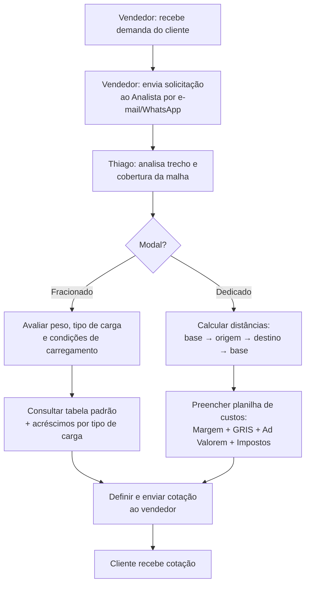
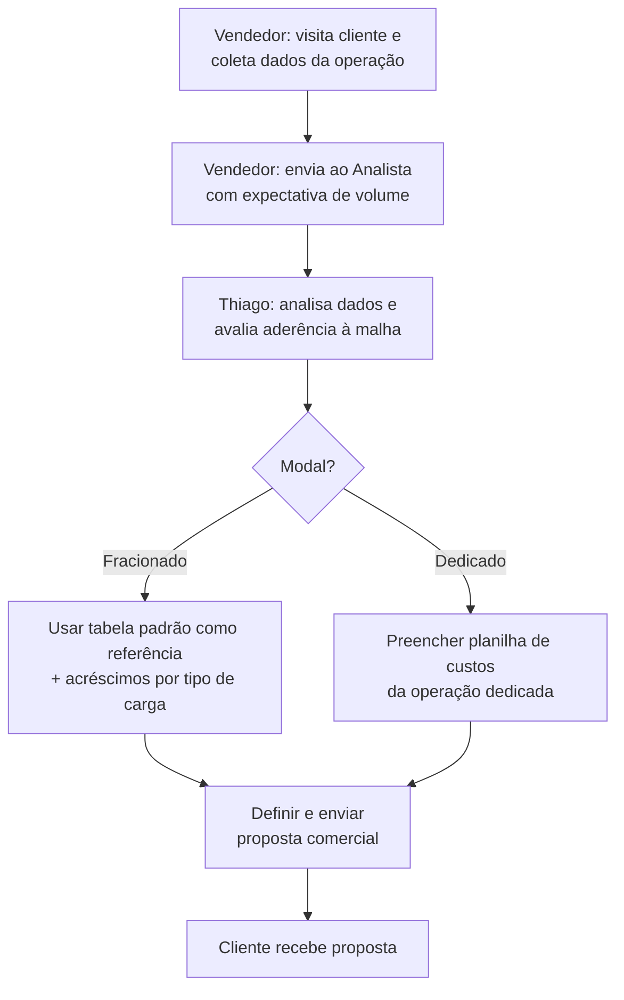
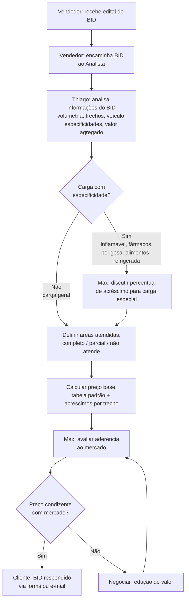

# Proposta Nokk-Chat — Automação de Precificação Lauto

> Documento de trabalho para construção do orçamento comercial.
> Baseado em `docs/resumo.pdf` (reunião com Thiago — 22/04/2026).
>
> **Status:** rascunho interno — números a validar com discovery.

---

## 1. Contexto do cliente

**Cliente:** Lauto (transportadora)
**Stakeholders mapeados:**
- **Vendedor** — prospecta cliente e captura demanda
- **Thiago** — Analista de Precificação (gargalo central do processo)
- **Max** — Diretor Comercial (aprovações de carga especial e competitividade)

**Canal oficial:** e-mail. WhatsApp ocorre em paralelo, mas não é padrão — há esforço para centralizar no e-mail.

**Dor central:** todo o processo de precificação depende do tempo do Thiago. Cotação padrão leva horas, proposta comercial leva dias, BID leva ~1 semana. A capacidade de resposta limita receita nova.

---

## 2. Modalidades de precificação

| Modalidade | Complexidade | Volume | Tempo médio | Potencial de automação |
|---|---|---|---|---|
| Cotação Padrão | Baixa | **Alto** | Horas | Alto (regras + tabela) |
| Proposta Comercial | Média | Médio | Dias | Médio (assistido) |
| BID | Alta | Baixo | ~1 semana | **Alto** (IA + diagnóstico) |

---

## 3. Fluxo 1 — Cotação Padrão

Processo mais comum e rápido. Solicitações pontuais via portal **BRUDAM**, tabela ou e-mail.

### 3.1 Diagrama

### 3.2 Atividades

| # | Atividade | Responsável | Entrada | Saída |
|---|---|---|---|---|
| 1 | Receber demanda do cliente | Vendedor | Contato com necessidade de frete | Dados básicos da operação |
| 2 | Enviar solicitação ao Analista | Vendedor | Dados da operação | Solicitação por e-mail (preferencial) |
| 3 | Analisar trecho e cobertura de malha | Thiago | Origem e destino | Confirmação: total / parcial / não atende |
| 4a | Avaliar carga (Fracionado) | Thiago | Dados de carga | Carga classificada |
| 4b | Calcular distâncias da rota (Dedicado) | Thiago | Origem, destino, base | Distância total |
| 5a | Consultar tabela padrão (Fracionado) | Thiago | Trecho + classificação | Valor com acréscimos |
| 5b | Preencher planilha de custos (Dedicado) | Thiago | Distâncias, veículo, especificidades | Planilha com valor final |
| 6 | Definir e enviar cotação | Thiago | Tabela ou planilha | Cotação enviada (e-mail / portal BRUDAM) |

### 3.3 Gateway

- **Modal? (XOR)**
  - **Fracionado** → consulta tabela padrão diretamente
  - **Dedicado** → planilha de custos com cálculo de rota completa

---

## 4. Fluxo 2 — Proposta Comercial

Vendedor visita o cliente e traz dados para uma proposta personalizada. Pode incluir referência de preço de concorrentes.

### 4.1 Diagrama

### 4.2 Atividades

| # | Atividade | Responsável | Entrada | Saída |
|---|---|---|---|---|
| 1 | Visitar cliente e coletar dados | Vendedor | Interesse do cliente | Dados + expectativa de volume |
| 2 | Enviar solicitação ao Analista | Vendedor | Dados da operação | Solicitação com contexto de demanda |
| 3 | Analisar dados e aderência à malha | Thiago | Dados + expectativa | Escopo da proposta |
| 4a | Tabela padrão como referência (Fracionado) | Thiago | Tabela + expectativa | Valor estimado |
| 4b | Planilha de custos (Dedicado) | Thiago | Demanda dedicada | Planilha com custos |
| 5 | Definir e enviar proposta | Thiago | Valores calculados | Proposta enviada por e-mail |

### 4.3 Gateway

- **Modal? (XOR)** — mesma lógica da Cotação Padrão, aplicado sobre expectativa de volume.

---

## 5. Fluxo 3 — BID

Concorrência formal lançada pelo cliente. Geralmente para operações dedicadas de grande porte. Pode levar até uma semana para resposta.

### 5.1 Diagrama

### 5.2 Atividades

| # | Atividade | Responsável | Entrada | Saída |
|---|---|---|---|---|
| 1 | Receber edital do cliente | Vendedor | Edital de BID | Documento em mãos |
| 2 | Encaminhar ao Analista | Vendedor | Edital + contexto estratégico | BID encaminhado |
| 3 | Analisar informações do BID | Thiago | Documento de BID | Operação mapeada e classificada |
| 4 | Discutir % de acréscimo (se especial) | Max | Tipo de especificidade | Percentual acordado |
| 5 | Definir áreas atendidas | Thiago | Malha Lauto + trechos do BID | Mapa de cobertura |
| 6 | Calcular preço base por trecho | Thiago | Tabela + cobertura + acréscimos | Proposta por trecho |
| 7 | Avaliar aderência ao mercado | Max | Proposta + mercado + volumetria | Decisão de competitividade |
| 8 | Negociar redução de valor | Max + Thiago | Preço + referência + volumetria | Novo valor ou desistência |

### 5.3 Especificidades de carga avaliadas

- Inflamável
- Fármacos / medicamentos (regulação ANVISA)
- Carga perigosa
- Alimentos (restrição de mix de cargas)
- Refrigerada (veículo especial, custo maior)
- Valor agregado alto (impacto em seguro / GRIS)

### 5.4 Gateways

- **Carga com especificidade? (XOR)**
  - **Sim** → discutir % de acréscimo com Max antes do preço
  - **Não** → segue direto para definição de áreas
- **Preço condizente com mercado? (XOR)**
  - **Sim** → envia ao cliente
  - **Não** → renegocia; se inviável, não participa

---

## 6. Observações gerais (extraídas do documento)

- **Canal oficial:** e-mail. WhatsApp existe mas não é padrão.
- **Tabela padrão:** referência central para Cotação Padrão e Proposta Comercial fracionada.
- **Percentuais de acréscimo NÃO são fixos hoje** — definidos caso a caso. O documento explicita que essa padronização é "evolução importante para viabilizar automatização". **→ Entrega obrigatória da fase de setup.**
- **BID tem maior potencial de automação** apesar de mais trabalhoso. Ganho concentrado em: leitura do edital, diagnóstico inicial de cobertura, comparação com clientes sinérgicos.
- **Modal no BID** já vem definido pelo cliente. Aéreo (ex.: Azul Cargo) requer cotação externa — **fora do escopo de automação**.
- **Cobertura parcial em BID nacional:** raramente atendido integralmente; proposta cobre apenas regiões efetivamente atendidas.

---

## 7. Mapeamento Nokk-Chat × Lauto

| Capacidade Nokk | Aplicação no processo Lauto |
|---|---|
| Omnichannel (e-mail + WhatsApp) | Captura de entrada do vendedor/cliente, centralização no e-mail oficial |
| Disparo de e-mail | Resposta de cotação, follow-up, envio de proposta |
| IA com análise de documento (Jina + LLM) | **Leitura de edital BID** — ponto de maior valor |
| Automação / orquestração | Cotação padrão automática, classificação de carga, roteamento por modal |
| Workflow com gates de aprovação | Acréscimo carga especial → Max; preço fora de mercado → renegociação |

---

## 8. SKUs propostos

### SKU 1 — Cotação Padrão Automatizada

**Escopo**
- Entrada por e-mail / WhatsApp / portal BRUDAM
- Extração estruturada (origem, destino, peso, tipo de carga)
- Validação de cobertura de malha
- Cálculo automático: tabela padrão + acréscimos
- Resposta em minutos ao vendedor / cliente

**Ganho vendido:** redução de ~80% do tempo do Thiago no fluxo de maior volume.

**Métrica de sucesso:** % de cotações respondidas sem intervenção humana; tempo médio de resposta.

---

### SKU 2 — Assistente de Proposta Comercial

**Escopo**
- Vendedor envia dados da visita (e-mail / WhatsApp)
- Sistema extrai, valida malha, monta planilha de custos preliminar
- Thiago revisa e aprova (não digita do zero)
- Histórico de propostas por cliente

**Ganho vendido:** padronização de propostas + ciclo de dias para horas.

**Métrica de sucesso:** tempo médio Vendedor → Cliente; taxa de retrabalho.

---

### SKU 3 — Diagnóstico de BID (Premium IA)

**Escopo**
- Upload do edital → leitura por IA (Jina + LLM)
- Saída automática:
  - Mapa de cobertura por trecho (atende / parcial / não atende)
  - Lista de clientes sinérgicos na rota
  - Preço-base por trecho aplicando tabela padrão
  - Flag de cargas especiais com sugestão de acréscimo
  - Estimativa de competitividade por trecho
- Thiago + Max recebem **draft pronto para revisar**

**Ganho vendido:** ciclo de ~1 semana → ~1 dia. Capacidade de participar de **mais BIDs** com mesma equipe.

**Métrica de sucesso:** nº de BIDs respondidos/mês; taxa de vitória.

---

## 9. Estrutura comercial

### 9.1 Setup (one-time): **R$ 12.800**

Inclui:
- Consultoria de **padronização dos percentuais de acréscimo** por tipo de carga (entregável: tabela fixa)
- Modelagem dos 3 fluxos no Nokk
- Integração com e-mail oficial + WhatsApp + portal BRUDAM (API ou scraping leve)
- Templates de resposta e proposta
- Treinamento (Thiago, Max, vendedores)

> Justificativa: a automação não roda sem a padronização de acréscimos. Sem essa entrega de consultoria, SKU 1 e SKU 3 ficam mancos.

### 9.2 Mensal — modelo escalonado

| Item | Valor | Inclusos | Overage |
|---|---|---|---|
| Plataforma base | R$ 1.290 | Workspace, omnichannel, dashboards, suporte | — |
| Cotação Padrão | R$ 1.490 | 600 cotações / mês | R$ 2,80 / cotação |
| Proposta Comercial | R$ 990 | 60 propostas / mês | R$ 14 / proposta |
| BID Premium IA | R$ 1.890 | 6 BIDs / mês | R$ 290 / BID |
| **Total cheio** | **R$ 5.660** | — | — |
| Enxuto (Plataforma + Cotação) | R$ 2.780 | — | — |

### 9.3 Estratégia em 2 fases (recomendada)

**Fase 1 (mês 1–3) — Prova de valor**
- Setup R$ 12.800 + Plataforma + Cotação Padrão
- Mensal: **R$ 2.780**
- Foco: provar redução de tempo do Thiago no fluxo de maior volume

**Fase 2 (mês 4+) — Expansão**
- Adicionar Proposta Comercial + BID Premium
- Mensal: **+R$ 2.880** → total R$ 5.660
- Justificado pelos resultados da Fase 1

**Vantagens da abordagem em fases:**
- Menor fricção na entrada
- Dados reais de consumo para precificar Fase 2 com precisão
- Lock-in natural após Fase 1

---

## 10. Ancoragem de valor (para a apresentação)

> **"Hoje o Thiago é o gargalo de toda receita nova. Nokk não substitui ele — multiplica ele."**

Argumentos quantitativos:
- **Capacidade do Analista:** dobrar throughput de cotação padrão equivale a 0,5–1 FTE (~R$ 4–8k/mês).
- **BIDs adicionais:** ganhar 1 BID/trimestre antes inalcançável paga a camada IA.
- **Padronização de acréscimos:** elimina divergência entre Thiago e Max — governança vendável.
- **SLA de resposta:** ganhar contas onde concorrente demora dias.

---

## 11. Discovery pendente (antes de fechar)

Sem esses dados, qualquer pacote acima é estimativa.

- [ ] Volume de cotações padrão / mês
- [ ] Volume de propostas comerciais / mês
- [ ] Volume de BIDs / mês + ticket médio
- [ ] Formato atual da tabela padrão (Excel / sistema / API)
- [ ] Existe ERP / TMS atual? Como integra?
- [ ] Max topa formalizar percentuais de acréscimo? (bloqueador para SKU 1 e 3)
- [ ] 1–2 editais antigos de BID anonimizados (para POC mental e demo)
- [ ] Volume de e-mails outbound / mês (impacta pacote de disparo)

---

## 12. Riscos e mitigações

| Risco | Mitigação |
|---|---|
| Editais BID muito heterogêneos quebram extração IA | Cap por documento + pré-flight de tokens + fallback humano |
| Lauto resiste a formalizar % de acréscimo | Vender consultoria como entregável **separado** no setup |
| Portal BRUDAM sem API estável | Avaliar scraping leve ou integração manual assistida na Fase 1 |
| Custo de tokens dispara em BIDs grandes | Roteamento por complexidade (Jina pré-filtro, LLM só onde necessário) + cache semântico |
| Cliente compara com concorrente flat (R$ 69 / licença) | Reposicionar: concorrente não lê documento; Nokk substitui horas-analista |

---

## 13. Próximos passos sugeridos

1. Agendar **30 min com Thiago** para coletar volumes (item 11).
2. Solicitar **1–2 editais BID antigos** anonimizados.
3. Confirmar com **Max** disposição para padronizar acréscimos.
4. Revisar este documento com Diretor Comercial Nexcode antes de levar a Lauto.
5. Montar slide executivo a partir das seções 7, 8 e 9.
